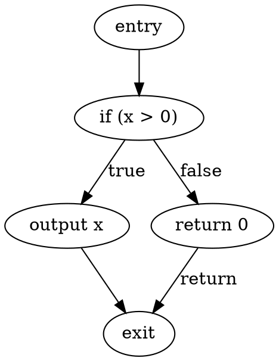

# Source CFG and Inspection Interface Implementation Plan

## Status and Scope

This is the implementation plan for two related baseline improvements to `topc`:

1. A source-level, intraprocedural control-flow graph (CFG) subsystem that
   students can build on in `sopc`.
2. A clean, result-first inspection CLI that distinguishes compiler results from
   the constraints, derivations, and traces used to obtain them.

The work is intentionally test-driven. Every phase begins by adding focused
acceptance tests, then makes the smallest production change that satisfies those
tests. Do not begin a phase until its listed tests are present and failing for
the expected missing behavior. Do not move to the next phase until its tests and
the regression suite are green.

This plan is a clean break from the existing inspection options. The old
`--pp`, `--ps`, `--pt`, `--pa`, `--pc`, and `--pcg` interfaces are removed rather
than retained as compatibility aliases.

## Goals

### Source CFG goals

- Represent TOP source control flow, not LLVM IR control flow.
- Build one deterministic CFG per TOP function.
- Store CFGs as a named `SemanticAnalysis` result, alongside `CallGraph`.
- Preserve AST ownership and source locations; CFGs reference AST nodes rather
  than copying or mutating them.
- Support future flow-sensitive move analysis, borrow/lifetime analysis,
  definite-assignment analysis, and SOP loops without an API redesign.
- Provide stable DOT and ASCII renderings suitable for students and golden
  tests.

### Inspection CLI goals

- Let students ask for a result by compiler concept rather than an acronym.
- Let `--constraint` add the derivation relevant to the requested result.
- Generate no bitcode merely because an inspection result was requested.
- Write graph-like results to deterministic sibling files by default.
- Render textual results to stdout by default, so they compose naturally with
  the terminal and shell redirection.
- Keep output deterministic and source-oriented.

## Non-Goals

- Do not use LLVM basic blocks as the compiler's source CFG API.
- Do not introduce SSA, dominators, post-dominators, or a generic dataflow
  framework in the initial CFG implementation.
- Do not migrate `MoveAnalysis` from its current AST-recursive implementation
  in the same change that introduces CFG construction.
- Do not expose an AST-construction constraint view initially.
- Do not make CFG construction depend on successful type inference.

## Architectural Decisions

### 1. Source CFG versus LLVM CFG

The compiler needs a CFG derived from the TOP AST. LLVM basic blocks are created
only during code generation and include lowering details that obscure the source
language. The source CFG is the representation analyses and students should use:

```text
AST -> IntraproceduralCFGs -> semantic dataflow analyses -> LLVM IR -> LLVM CFG
```

The source CFG is constructed after the AST and structural checks are available,
but before type inference, ownership analysis, AST destruction insertion, and
code generation.

### 2. `IntraproceduralCFGs` is a named analysis result

`IntraproceduralCFGs` owns all per-function graphs and is retained in
`SemanticAnalysis`. It is separate from `CallGraph` because the call graph is
interprocedural CFA output, while this component models control flow inside one
TOP function.

### 3. CFGs are immutable source artifacts

Blocks retain non-owning `const ASTStmt *` and `const ASTExpr *` references. The
AST owns the nodes for the life of semantic analysis and code generation. The
builder completes each graph before exposing it; public APIs permit traversal but
not mutation.

### 4. Destruction insertion does not redefine source CFGs

CFGs are built before `DestructionPass` adds `ASTDestroyStmt` nodes. The graph
continues to describe source control flow. Future destruction placement analyses
consume the source CFG and determine cleanup per path; they do not mutate or
rebuild the source CFG as an incidental effect.

### 5. Result views and constraint views are distinct

Every `--p...` option requests the result produced for one compiler concept.
`--constraint` requests supporting constraints, derivations, or execution traces
for the selected result views where such information exists.

## CFG API

Create `src/semantic/cfg/` and use the following public types.

### `CFGTypes.h`

```cpp
using BlockId = std::size_t;

enum class CFGEdgeKind {
  Fallthrough,
  TrueBranch,
  FalseBranch,
  CaseArm,
  ReturnToExit,
};

struct CFGEdge {
  BlockId target;
  CFGEdgeKind kind;
  std::string label;
};

enum class CFGTerminatorKind {
  Fallthrough,
  If,
  While,
  Case,
  Return,
};
```

`label` is empty for ordinary edges. For `CaseArm` edges it is stable,
source-oriented arm text such as `Some(x)` or `None`.

### `BasicBlock.h/.cpp`

```cpp
class BasicBlock {
public:
  BlockId getId() const;
  const std::string &getName() const;
  const std::vector<const ASTStmt *> &getStatements() const;
  CFGTerminatorKind getTerminatorKind() const;
  const ASTStmt *getTerminatorStatement() const;
  const ASTExpr *getCondition() const;
  const std::vector<CFGEdge> &getSuccessors() const;
  const std::vector<BlockId> &getPredecessors() const;
};
```

Block names are deterministic and function-local:

```text
entry, b0, b1, ..., exit
```

`entry` and `exit` are synthetic blocks. All non-synthetic blocks may contain an
ordered sequence of ordinary statements. A control statement is not duplicated
as an ordinary statement: it is represented by the block terminator and its
condition/source node.

### `ControlFlowGraph.h/.cpp`

```cpp
class ControlFlowGraph {
public:
  const ASTFunction *getFunction() const;
  const BasicBlock &getEntry() const;
  const BasicBlock &getExit() const;
  const std::vector<BasicBlock> &getBlocks() const;
  const BasicBlock *findBlock(BlockId id) const;
  void validate() const;
};
```

`validate()` verifies all graph invariants and throws `InternalError` for an
invalid internally-built graph:

- exactly one entry and one exit block;
- unique block IDs and names;
- every edge target exists;
- predecessor and successor relations agree;
- no successor is duplicated with the same kind and label;
- entry has no predecessors;
- exit has no successors;
- every non-exit block has a terminator;
- return blocks have exactly one `ReturnToExit` edge to exit;
- if/while blocks have one true and one false edge;
- case blocks have one `CaseArm` edge per source arm;
- all blocks are reachable from entry, except blocks intentionally retained for
  a documented future unreachable-code diagnostic. The first implementation
  should omit unreachable lexical statements rather than retain dead blocks.

### `IntraproceduralCFGs.h/.cpp`

```cpp
class IntraproceduralCFGs {
public:
  static std::shared_ptr<IntraproceduralCFGs> build(ASTProgram *program);
  const ControlFlowGraph &get(const ASTFunction *function) const;
  std::vector<const ControlFlowGraph *> getAll() const;
};
```

The aggregate preserves source function order. `getAll()` returns graphs in that
same order, never pointer or map iteration order.

### `CFGBuilder.h/.cpp`

`CFGBuilder` is responsible only for AST-to-CFG construction. Its public entry
point is:

```cpp
class CFGBuilder {
public:
  static std::shared_ptr<IntraproceduralCFGs> build(ASTProgram *program);
};
```

The builder works in reverse, continuation-passing style. Given a statement
fragment and its continuation block, it returns the entry block for the
fragment. This naturally handles nested structured control flow and avoids a
global mutable "current block" convention.

## CFG Construction Rules

The following rules are acceptance-level semantics for the builder.

| TOP construct | CFG shape |
|---|---|
| Ordinary statement | Added to the current straight-line block, followed by a fallthrough edge to the continuation. |
| Statement sequence | Build right to left, passing each already-built prefix entry as the predecessor fragment's continuation. |
| Block statement | Build its contained statement sequence against the enclosing continuation. |
| `return e;` | Block terminates with `Return` and one `ReturnToExit` edge. It has no lexical-continuation edge. |
| `if (c) then` | Condition block terminates with `If`; true edge enters `then`, false edge goes directly to continuation. |
| `if (c) then else` | Condition block terminates with `If`; true and false edges enter separately built branches, each of which flows to the continuation when it completes normally. |
| `while (c) body` | Condition block terminates with `While`; true edge enters body, false edge goes to continuation, normal body completion falls through to condition. |
| `case e of { arms }` | Dispatch block terminates with `Case`; one labeled `CaseArm` edge enters each arm body; every normally completing arm flows to the continuation. |
| Nested control flow | Follows the same rules recursively; no special-case flattening. |

Function declarations are represented by their source `ASTFunction`; declaration
statements remain in the source function and symbol table but are not CFG
operations in the initial implementation. The function entry block falls through
to the first body block. The grammar guarantees a final return statement; the
builder must nevertheless handle an empty body defensively by connecting entry
to exit.

SOP's future `for` and range constructs should lower to an iteration condition
block, a body block, and a back edge using this same API. No new graph primitive
will be needed.

## Semantic Architecture Integration

### Required production changes

1. Add `src/semantic/cfg/CMakeLists.txt` and include it from
   `src/semantic/CMakeLists.txt`.
2. Add the new CFG library target and link it into `semantic`.
3. Extend `SemanticAnalysis`:

```cpp
std::shared_ptr<IntraproceduralCFGs> intraproceduralCFGs;

IntraproceduralCFGs *getIntraproceduralCFGs();
```

4. Update the `SemanticAnalysis` constructor so this is a required named
   result, not an optional side channel.
5. Construct CFGs in `SemanticAnalysis::analyze` after the structural/weeding
   checks and before `CallGraph::build`, type inference, ownership
   classification, move analysis, and destruction insertion.
6. Call `validate()` for every graph as part of construction in debug/test
   builds. The unit tests must always call it explicitly.

### Initial consumer policy

The first implementation adds no behavioral dependency from `MoveAnalysis` or
`BorrowChecker` to CFGs. Their existing diagnostics and tests remain unchanged.
The next distinct phase migrates move analysis to forward dataflow over CFG
blocks. A subsequent SOPC borrow/lifetime phase can compute use-based liveness
from the same CFGs.

## CFG Rendering

Create `CFGRenderer.h/.cpp` in `src/semantic/cfg/`.

### DOT output

DOT is the default. Render one subgraph or file per function, with stable block
names and source-level labels. Use explicit edge labels:



One `--pcfg` invocation creates one file per source function, as described in
the CLI contract below. Do not combine unrelated functions into an unreadable
single graph.

### ASCII output

ASCII is for terminal inspection and stable golden tests:

```text
[cfg main]
  entry -> b0
  b0: if (x > 0)
    true  -> b1
    false -> b2
  b1: output x
    fallthrough -> exit
  b2: return 0
    return -> exit
  exit
```

The ASCII renderer must retain source order for blocks and a fixed edge-kind
order: true, false, case arms in source order, fallthrough, return.

## Test-First CFG Plan

All tests below are written before production code for their phase. Test files
belong in `test/unit/semantic/cfg/`, and the unit target is extended in
`test/unit/semantic/CMakeLists.txt`.

### Phase CFG-1: Value objects and graph invariants

Create `BasicBlockTest.cpp` and `ControlFlowGraphTest.cpp` first.

Required tests:

1. `BasicBlock: exposes immutable statement sequence`
2. `BasicBlock: preserves successor labels and kinds`
3. `ControlFlowGraph: finds blocks by stable ID`
4. `ControlFlowGraph: rejects dangling successor`
5. `ControlFlowGraph: rejects inconsistent predecessor`
6. `ControlFlowGraph: rejects duplicate block ID`
7. `ControlFlowGraph: rejects entry predecessor`
8. `ControlFlowGraph: rejects exit successor`
9. `ControlFlowGraph: rejects malformed conditional successors`
10. `ControlFlowGraph: rejects malformed return successor`

Acceptance criteria:

- Tests fail before `BasicBlock` and `ControlFlowGraph` production code exists.
- All tests pass after the smallest valid value-object implementation.
- Existing unit test targets still compile and pass.

### Phase CFG-2: Straight-line and return construction

Create `CFGBuilderTest.cpp` first, using existing AST test helpers to parse TOP
program strings.

Required tests:

1. `CFGBuilder: one graph per source function in source order`
2. `CFGBuilder: entry reaches straight-line statements then return`
3. `CFGBuilder: preserves statement order inside a basic block`
4. `CFGBuilder: return reaches exit and not lexical continuation`
5. `CFGBuilder: two returns produce distinct return blocks`
6. `IntraproceduralCFGs: unknown function lookup is rejected`
7. `CFGBuilder: validates every completed graph`

Use a minimal program with assignment, output, and return. Assert block names,
terminator kinds, source statement text, and exact edges; do not merely assert
the total block count.

Acceptance criteria:

- Every graph validates.
- No AST node is modified by construction.
- Existing compiler and semantic tests remain green.

### Phase CFG-3: Conditional construction

Add failing tests before implementing `if` handling:

1. `CFGBuilder: if without else has true branch and fallthrough false branch`
2. `CFGBuilder: if with else joins normal branches at continuation`
3. `CFGBuilder: branch returning early does not have join edge`
4. `CFGBuilder: nested if preserves enclosing continuation`
5. `CFGBuilder: conditional source locations belong to terminator block`

Acceptance criteria:

- `If` blocks have exactly one true and one false edge.
- Only normally completing branches have continuation edges.
- Rendering order is deterministic across repeated builds.

### Phase CFG-4: Loop construction

Add failing tests before implementing `while` handling:

1. `CFGBuilder: while condition has true body edge and false continuation edge`
2. `CFGBuilder: normal loop body back edge returns to condition`
3. `CFGBuilder: loop body return reaches exit without back edge`
4. `CFGBuilder: nested loops retain separate condition blocks`
5. `CFGBuilder: loop following straight-line statement reaches continuation`

Acceptance criteria:

- Every loop has exactly one explicit back edge from normal body completion.
- Loop condition and body source locations are recoverable from their blocks.

### Phase CFG-5: Case construction

Add failing tests before implementing `case` handling:

1. `CFGBuilder: case dispatch has one edge per arm in source order`
2. `CFGBuilder: case arm edges retain stable pattern labels`
3. `CFGBuilder: normally completing arms join continuation`
4. `CFGBuilder: returning arm does not join continuation`
5. `CFGBuilder: nested case preserves outer continuation`

Acceptance criteria:

- Case-edge labels match the pretty-printed arm pattern exactly.
- No case arm is omitted or reordered.
- Sum-type and nested-pattern regression tests continue to pass.

### Phase CFG-5.5: Multi-position return enablement

Lift the grammar restriction that only allows `return` in the function tail.
`return` becomes a general statement form so it can appear in blocks, `if`,
`while`, and `case` arms while preserving a trailing function return.

Add failing tests before implementation:

1. `TOP Parser: nested returns in control flow`
2. `CFGBuilder: loop body return reaches exit without back edge`
3. `CFGBuilder: returning case arm does not join continuation`

Acceptance criteria:

- Grammar accepts nested returns in control-flow statement positions.
- CFG construction models nested returns as `Return` terminators to exit.
- Statements lexically after a direct return in the same sequence are omitted
   from reachable CFG construction.
- Existing parser, semantic, and CFG tests remain green.

### Phase CFG-6: Aggregate and semantic integration

Write integration tests before changing `SemanticAnalysis`:

1. `SemanticAnalysis: retains IntraproceduralCFGs`
2. `SemanticAnalysis: CFGs are available with call graph and type results`
3. `SemanticAnalysis: CFG construction precedes destruction insertion`
4. `SemanticAnalysis: destruction insertion does not mutate source CFG`
5. `SemanticAnalysis: existing move diagnostics remain unchanged`
6. `SemanticAnalysis: existing borrow diagnostics remain unchanged`

The destruction test should inspect a program that receives an inserted
`ASTDestroyStmt`. It must prove that the CFG contains only source statements,
while the post-analysis AST contains the inserted destruction statement.

Acceptance criteria:

- `IntraproceduralCFGs` is a required semantic result.
- `SemanticAnalysis` construction order is documented in code and covered by
  tests.
- All existing semantic, frontend, code generation, and system tests pass.

### Phase CFG-7: Rendering

Write `CFGRendererTest.cpp` before renderer production code.

Required tests:

1. `CFGRenderer: ASCII straight-line graph is exact and stable`
2. `CFGRenderer: ASCII if graph orders true before false`
3. `CFGRenderer: ASCII case graph preserves arm source order`
4. `CFGRenderer: DOT graph has stable IDs and labeled edges`
5. `CFGRenderer: DOT escapes source labels safely`
6. `CFGRenderer: repeated rendering is byte-identical`

Add system golden fixtures only after the renderer unit tests pass:

```text
test/system/selftests/ptr4.top.cfg.txt
test/system/selftests/ptr4.top.cfg.dot
test/system/selftests/sumtype-basic.top.cfg.txt
test/system/selftests/while.top.cfg.txt
```

Acceptance criteria:

- DOT and ASCII snapshots are stable.
- The renderer never depends on LLVM types, code generation, pointer addresses,
  or AST hash names.

## Clean-Break Inspection CLI

### Result options

Remove the old options and define the following new result options in
`src/topc.cpp`:

```text
--psource
--past[=dot|ascii]
--psym
--ptype
--pcallgraph[=dot|ascii]
--pcfg[=dot|ascii]
--pownership
--pborrow
--constraint
--output-dir=<directory>
```

`dot` is the default format for graph views. `--past` and `--pcallgraph` allow
both `dot` and `ascii` to keep behavior uniform. `--pcfg` uses the same format
syntax. Do not create a separate `--...-format` option.

### Result and constraint contract

| Result option | Result information | `--constraint` information |
|---|---|---|
| `--psource` | normalized source | unsupported; no constraint output |
| `--past` | source AST | unsupported initially |
| `--psym` | symbols and scopes | unsupported initially |
| `--ptype` | inferred types and generalized schemes | type equations, generalization boundaries, instantiation records |
| `--pcallgraph` | interprocedural CFA call graph | CFA/may-call constraints |
| `--pcfg` | per-function source CFG | unsupported initially; later may provide CFG-construction explanation |
| `--pownership` | Copy/Own result and destruction summary | ownership classification, move, and destruction trace |
| `--pborrow` | borrow validity result | borrow validity trace; future lifetime/region constraints |

`--constraint` with no selected view, or only with a selected view that does not
support constraints, is a command-line error. It must say which selected views
do not support it and list the supported views.

With multiple views, emit each requested result and then its relevant constraint
section in a fixed order:

```text
source, ast, symbols, types, callgraph, cfg, ownership, borrow
```

### Output destinations

Text results write to stdout by default. Graph outputs write to deterministic
siblings of the source file by default. `--output-dir` relocates generated graph
files only; `-o` remains exclusively the bitcode/assembly destination.

| Invocation | Default output |
|---|---|
| `--psource` | stdout |
| `--psym` | stdout |
| `--ptype` | stdout |
| `--pownership` | stdout |
| `--pborrow` | stdout |
| `--past` | `<source>.ast.dot` |
| `--past=ascii` | `<source>.ast.txt` |
| `--pcallgraph` | `<source>.callgraph.dot` |
| `--pcallgraph=ascii` | `<source>.callgraph.txt` |
| `--pcfg` | `<source>.<function>.cfg.dot` per function |
| `--pcfg=ascii` | stdout, one `[cfg function]` section per function |

For a source path `examples/hello.top`, the AST DOT output is
`examples/hello.top.ast.dot`. The CFG files are, for example,
`examples/hello.top.main.cfg.dot` and `examples/hello.top.helper.cfg.dot`.

### Inspection pipeline

The driver must stop doing unconditional code generation. Compute only the
furthest phase necessary for the requested outputs:

| Requested output | Required pipeline |
|---|---|
| `--psource`, `--past` | parse only |
| `--psym`, `--pcfg` | parse, symbol table, structural checks, source CFG build |
| `--pcallgraph` | previous phases plus CFA/call graph |
| `--ptype` | previous phases plus type inference |
| `--pownership` | previous phases plus ownership, move analysis, destruction insertion |
| `--pborrow` | structural borrow checker; future lifetime analysis may additionally require CFG/types |
| compilation | complete semantic pipeline, code generation, optimization, emission |

An invocation containing only inspection options must not create a `.bc` or `.ll`
file. A mixed invocation may inspect and compile in one process.

`--past` always renders the pre-semantic, source AST. A future explicitly named
option may render the post-destruction AST; do not silently change what the AST
view means.

## Test-First CLI Plan

Add a focused CLI test helper if necessary, but preserve `test/system/run.py` as
the end-to-end acceptance layer. Replace all old-option snapshots rather than
keeping duplicate test matrices.

### Phase CLI-1: Parse and validate the new surface

Add failing driver tests first:

1. `--psource`, `--past`, `--psym`, `--ptype`, `--pcallgraph`, `--pcfg`,
   `--pownership`, and `--pborrow` are accepted.
2. `--past=dot|ascii`, `--pcallgraph=dot|ascii`, and `--pcfg=dot|ascii` are
   accepted.
3. Invalid format values produce a focused error naming valid values.
4. Every old option is rejected as unknown: `--pp`, `--ps`, `--pt`, `--pa`,
   `--pc`, and `--pcg`.
5. `--constraint` with no supported selected view fails with a focused error.
6. `--constraint --ptype` and `--constraint --pcallgraph` are accepted.
7. Repeating a result option is idempotent and does not duplicate output.
8. Multiple result options are accepted and rendered in documented order.

Acceptance criteria:

- The driver help lists only the new option vocabulary.
- No old option remains in source, README, system tests, or student docs.

### Phase CLI-2: Source and AST views without semantic/codegen work

Add failing tests first:

1. `--psource` formats a syntactically valid but semantically invalid program.
2. `--past` writes `<source>.ast.dot` without an explicit output filename.
3. `--past=ascii` writes `<source>.ast.txt`.
4. `--past` output is the pre-semantic AST and lacks inserted destruction nodes.
5. `--psource --past` produces both requested artifacts/results in one run.
6. These inspection-only commands create neither `.bc` nor `.ll` output.
7. `--output-dir` redirects graph artifacts and creates no source-directory
   artifact.

Acceptance criteria:

- Parse-only views do not invoke semantic analysis or code generation.
- Existing parser and pretty-printer tests continue to pass.

### Phase CLI-3: Semantic result views

Add failing exact-output/snapshot tests first:

1. `--psym` prints symbols and scopes without inferred types.
2. `--ptype` prints inferred types and generalized schemes but no raw type
   constraints.
3. `--pcallgraph` writes a stable DOT call graph by default.
4. `--pcallgraph=ascii` prints a source-ordered textual graph.
5. `--pcfg` writes one stable DOT file per function.
6. `--pcfg=ascii` emits all graphs in source function order.
7. `--pownership` reports ownership result and destruction summary.
8. `--pborrow` reports borrow validity result.

Acceptance criteria:

- Result views contain no unrelated raw constraints.
- The relevant view computes only required pipeline stages.
- Per-function CFG filenames are deterministic and collision-free.

### Phase CLI-4: Constraint modifier

Add failing tests first:

1. `--ptype --constraint` contains type constraints, type schemes, and
   instantiation records, in separate labeled sections.
2. `--pcallgraph --constraint` contains CFA call-site/target records.
3. `--pownership --constraint` contains ownership and move/destruction traces.
4. `--pborrow --constraint` contains the borrow-validity trace.
5. `--ptype --pcallgraph --constraint` emits results and only the two matching
   constraint sections in documented order.
6. `--past --constraint` fails because AST constraints are unsupported.
7. `--pcfg --constraint` fails because CFG-construction explanation is not yet
   a supported constraint view.
8. Every output line has either a source span or an explicit
   `compiler-generated` origin; it must never display an unexplained `-` span.

Acceptance criteria:

- Constraints are opt-in detail, never implicit in a result view.
- Constraint rendering remains deterministic and source-oriented.

### Phase CLI-5: Compilation coexistence and artifact behavior

Add failing tests first:

1. `topc source.top` retains the existing default compile behavior.
2. `topc --ptype source.top` creates no bitcode.
3. `topc --ptype -o output.bc source.top` prints types and creates `output.bc`.
4. `topc --past --asm -o output.ll source.top` creates both AST and assembly
   artifacts.
5. Failed graph-output creation reports the requested path and exits nonzero.
6. A semantic error prevents only views requiring semantic success; `--psource`
   and `--past` remain available for the same input.

Acceptance criteria:

- No output mode silently creates unrelated files.
- `-o` has exactly one meaning: compilation output.
- Existing bitcode, assembly, runtime, and system behavior remains green.

## Documentation and Test-Harness Migration

Update documentation only after all behavior is tested and stable.

1. Replace the option list and usage examples in `README.md`.
2. Replace old golden suffixes and commands in `test/system/README.md`.
3. Rewrite `docs/feature-inspection-demo.md` around small question-and-answer
   examples, beginning with result views and then adding `--constraint`.
4. Consolidate the design content from `docs/pretty-proposal.md` and
   `docs/constraint-inspection-proposal.md` into the implemented interface
   documentation. Remove or mark the older proposals historical once their
   content has been superseded.
5. Update `test/system/run.py` to use only new flags and new expected artifact
   names.
6. Add a brief CFG section to the student-facing compiler architecture
   documentation, explaining that it is source-level and distinct from LLVM
   basic blocks.

## Full Regression Gates

Run these gates after every completed phase, not only at the end:

```bash
cmake --build build
ctest --test-dir build --output-on-failure
TOPCLANG=/path/to/clang ./bin/runtests.sh -s
```

For focused work, run the smallest relevant Catch2 target and the relevant
driver snapshot tests first. Before merging the complete change, run the full
unit and system suites above.

## Completion Checklist

The work is complete only when all statements below are true:

1. `IntraproceduralCFGs` is built, validated, and retained by
   `SemanticAnalysis`.
2. CFG construction covers all current TOP structured control flow: straight
   line, return, block, if/else, while, and case.
3. DOT and ASCII CFG outputs are deterministic and covered by unit and system
   golden tests.
4. Existing move and borrow diagnostics remain unchanged before their separate
   CFG-backed migrations.
5. The old acronym-heavy inspection options are absent.
6. Every new `--p...` option returns only its relevant result information.
7. `--constraint` returns only derivation/trace data relevant to selected,
   supported result views.
8. Inspection-only invocations do not emit code artifacts.
9. Default graph output names are deterministic and documented.
10. README, system-test documentation, demo material, and `--help` agree on
    the final interface.
11. The complete build, unit suite, and system suite are green.

## Progress Tracker

Use this tracker as the execution dashboard. Keep checkboxes current as phases
start and complete. A phase can be marked complete only when its acceptance
criteria are met and the full regression gates pass.

### CFG workstream

- [x] CFG-1 Value objects and invariants
   Tests first:
   `test/unit/semantic/cfg/BasicBlockTest.cpp`,
   `test/unit/semantic/cfg/ControlFlowGraphTest.cpp`
   Production targets:
   `src/semantic/cfg/CFGTypes.h`,
   `src/semantic/cfg/BasicBlock.h/.cpp`,
   `src/semantic/cfg/ControlFlowGraph.h/.cpp`

- [x] CFG-2 Straight-line and return construction
   Tests first:
   `test/unit/semantic/cfg/CFGBuilderTest.cpp`
   Production targets:
   `src/semantic/cfg/CFGBuilder.h/.cpp`,
   `src/semantic/cfg/IntraproceduralCFGs.h/.cpp`

- [x] CFG-3 Conditional construction (`if`/`if-else`)
   Tests first:
   extend `test/unit/semantic/cfg/CFGBuilderTest.cpp`
   Production targets:
   `src/semantic/cfg/CFGBuilder.cpp`

- [x] CFG-4 Loop construction (`while`)
   Tests first:
   extend `test/unit/semantic/cfg/CFGBuilderTest.cpp`
   Production targets:
   `src/semantic/cfg/CFGBuilder.cpp`

- [x] CFG-5 Case construction (`case`)
   Tests first:
   extend `test/unit/semantic/cfg/CFGBuilderTest.cpp`
   Production targets:
   `src/semantic/cfg/CFGBuilder.cpp`

- [x] CFG-5.5 Multi-position return enablement
   Tests first:
   `test/unit/frontend/TOPParserTest.cpp`,
   extend `test/unit/semantic/cfg/CFGBuilderTest.cpp`
   Production targets:
   `src/frontend/TOP.g4`, `topg4/TOP.g4`,
   `src/semantic/cfg/CFGBuilder.cpp`

- [ ] CFG-6 Aggregate and semantic integration
   Tests first:
   new/extended tests in `test/unit/semantic/` for `SemanticAnalysis`
   integration and non-regression of move/borrow behavior
   Production targets:
   `src/semantic/SemanticAnalysis.h/.cpp`,
   `src/semantic/CMakeLists.txt`,
   `test/unit/semantic/CMakeLists.txt`

- [ ] CFG-7 Rendering and system snapshots
   Tests first:
   `test/unit/semantic/cfg/CFGRendererTest.cpp`
   System goldens:
   `test/system/selftests/*.cfg.txt`,
   `test/system/selftests/*.cfg.dot`
   Production targets:
   `src/semantic/cfg/CFGRenderer.h/.cpp`,
   `test/system/run.py`

### CLI workstream

- [ ] CLI-1 New option surface and validation
   Tests first:
   extend driver option tests in `test/system/run.py`
   Production targets:
   `src/topc.cpp`, `README.md`, `test/system/README.md`

- [ ] CLI-2 Parse-only source/AST views and artifact behavior
   Tests first:
   extend `test/system/run.py` with parse-only and no-codegen assertions
   Production targets:
   `src/topc.cpp`, frontend call points as needed

- [ ] CLI-3 Semantic result views
   Tests first:
   add/replace result snapshots in `test/system/selftests/` and
   `test/system/iotests/`; update `test/system/run.py`
   Production targets:
   `src/topc.cpp`, renderers/printers as needed

- [ ] CLI-4 `--constraint` modifier behavior
   Tests first:
   extend `test/system/run.py` for supported/unsupported pairings and output
   section ordering
   Production targets:
   `src/topc.cpp`, constraint rendering call sites

- [ ] CLI-5 Compile/inspect coexistence
   Tests first:
   extend `test/system/run.py` for mixed-mode artifacts and failure behavior
   Production targets:
   `src/topc.cpp`, artifact path handling

### Documentation and harness workstream

- [ ] DOC-1 Update user-facing CLI docs
   Targets:
   `README.md`, `test/system/README.md`,
   `docs/feature-inspection-demo.md`

- [ ] DOC-2 Consolidate or retire superseded proposals
   Targets:
   `docs/pretty-proposal.md`,
   `docs/constraint-inspection-proposal.md`

- [ ] HARNESS-1 Final test-harness synchronization
   Targets:
   `test/system/run.py`,
   required golden files in `test/system/`

### Suggested commit slicing

- [ ] Commit A: CFG-1 + CFG-2 (+ CMake wiring)
- [ ] Commit B: CFG-3 + CFG-4 + CFG-5
- [ ] Commit C: CFG-6 + CFG-7
- [ ] Commit D: CLI-1 + CLI-2
- [ ] Commit E: CLI-3 + CLI-4 + CLI-5
- [ ] Commit F: DOC-1 + DOC-2 + HARNESS-1 cleanup

### Resume protocol

When resuming work on another machine/session:

1. Run `git status --short`.
2. Open this file and identify the first unchecked phase.
3. Implement only that phase's tests first.
4. Make tests pass with the smallest production change.
5. Run full regression gates.
6. Mark the phase complete and commit.