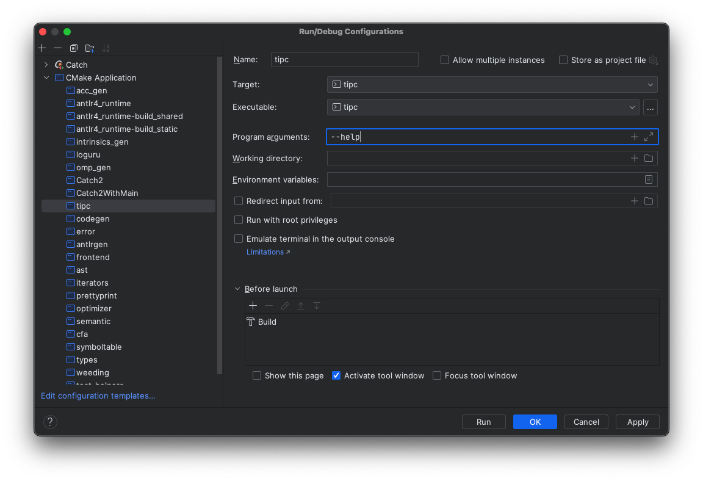

# Developing on UVA Hardware with CLion

You can develop `topc` on UVA CS servers such as `portal` or `granger`. Those
machines provide the compiler and build dependencies used by the course setup.
These notes show how to connect with JetBrains Gateway and CLion's thin client.

## Configure SSH

Generate an SSH key for portal connections:

```bash
mkdir -p ~/.ssh
cd ~/.ssh
ssh-keygen -t ed25519 -b 4096
```

Copy the public key to the remote server:

```bash
ssh-copy-id -i ~/.ssh/<keyname> <computingID>@portal.cs.virginia.edu
```

Test the connection:

```bash
ssh -i ~/.ssh/<keyname> <computingID>@portal.cs.virginia.edu
```

You can make the login shorter with `~/.ssh/config`:

```sshconfig
Host portal
  User <computingID>
  HostName portal.cs.virginia.edu
  IdentityFile ~/.ssh/<keyname>
```

After that, connect with:

```bash
ssh portal
```

## Clone TOPC

From `portal`, clone the public repository:

```bash
git clone https://github.com/matthewbdwyer/topc.git
```

## Configure The Remote Environment

Load the `topc` modulefile from the checkout:

```bash
module load ~/topc/conf/modulefiles/topc/F26
```

The modulefile assumes the repository is cloned at `~/topc`. If you clone it
elsewhere, update the `topdir` variable in `conf/modulefiles/topc/F26`.

Confirm the environment is set:

```bash
echo $TOPCLANG
# /sw/ubuntu2204/clangllvm/22.1.0/bin/clang
```

To load the environment on every portal login:

```bash
echo 'module load ~/topc/conf/modulefiles/topc/F26' >> ~/.bashrc
```

## Build From The Command Line

From the `topc` checkout:

```bash
mkdir build
cd build
cmake ..
make -j4
```

## Connect With JetBrains Gateway

Launch JetBrains Gateway and choose **New Connection** under **SSH Connection**.


Create or select your `portal` SSH configuration.


Use **Test Connection** to verify the SSH configuration.


Return to the connection page and select **Check Connection and Continue**.


Choose CLion as the IDE and select the `topc` checkout as the project directory.


Once Gateway connects, open the remote project.


## Configure CLion

If CLion shows the project wizard, accept the default toolchain and configure the
CMake profile with:

- Generator: `Unix Makefiles`
- Build directory: `build`
- Environment: `LLVM_DIR=/sw/ubuntu2204/llvm/22.1.0/lib/cmake`


If the wizard does not appear, open CLion settings and configure the default
CMake profile under **Build, Execution, Deployment**.

## Run TOPC From CLion

Use the run/debug controls after CLion finishes indexing and configuring the
project.


Program arguments can be set in the run/debug configuration.


For example, pass `--help` as a program argument:



[1]: https://www.cs.virginia.edu/wiki/doku.php?id=compute_portal
[2]: https://www.ssh.com/academy/ssh/config
[3]: https://www.cs.virginia.edu/wiki/doku.php?id=linux_environment_modules
[4]: https://modules.readthedocs.io/en/stable/modulefile.html
[5]: https://www.jetbrains.com/remote-development/gateway/
[6]: https://www.jetbrains.com/help/clion/remote-development-a.html