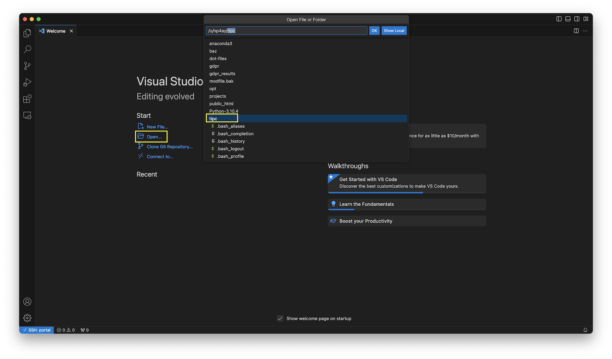
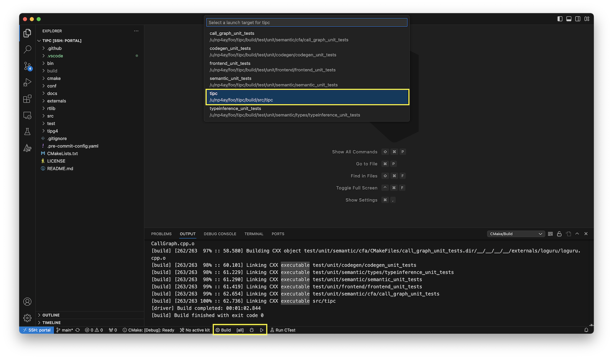
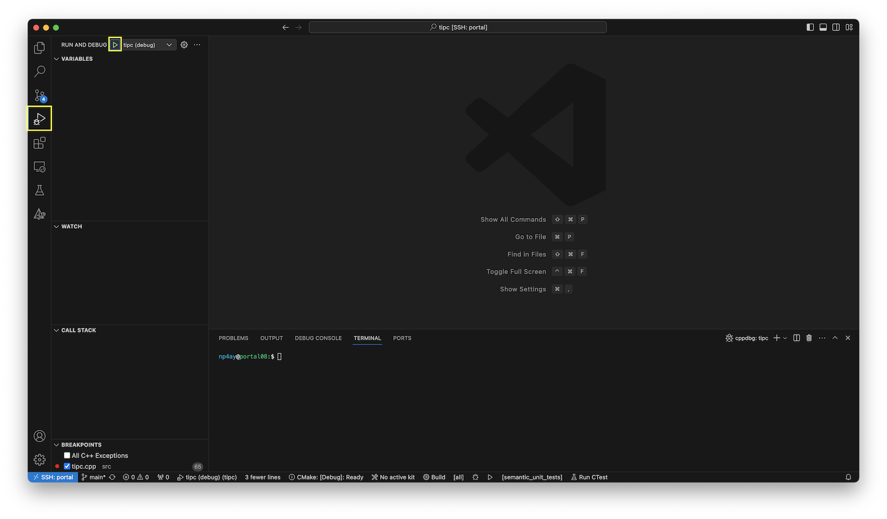
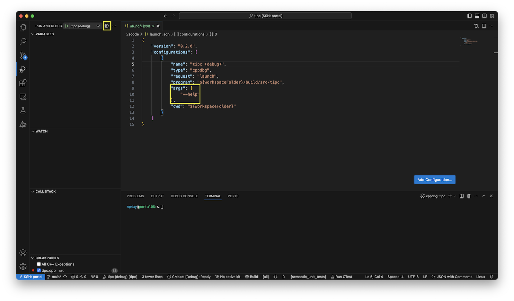
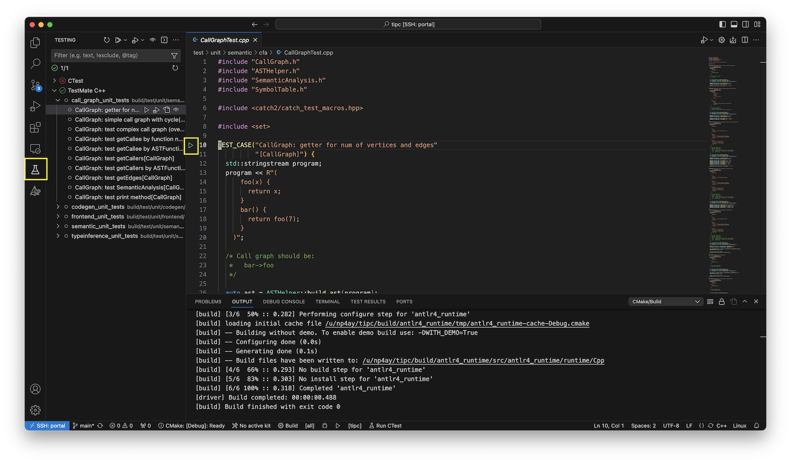

# Developing on UVA Hardware with VS Code

You can develop `topc` on UVA CS servers such as `portal` or `granger`. These
notes show how to connect from VS Code with the Remote - SSH extension.

## Configure SSH

Generate an SSH key for portal connections:

```bash
mkdir -p ~/.ssh
cd ~/.ssh
ssh-keygen -t ed25519 -b 4096
```

Copy the public key to the remote server:

```bash
ssh-copy-id -i ~/.ssh/<keyname> <computingID>@portal.cs.virginia.edu
```

Test the connection:

```bash
ssh -i ~/.ssh/<keyname> <computingID>@portal.cs.virginia.edu
```

You can make the login shorter with `~/.ssh/config`:

```sshconfig
Host portal
  User <computingID>
  HostName portal.cs.virginia.edu
  IdentityFile ~/.ssh/<keyname>
```

After that, connect with:

```bash
ssh portal
```

## Clone TOPC

From `portal`, clone the public repository:

```bash
git clone https://github.com/matthewbdwyer/topc.git
```

## Configure The Remote Environment

Load the `topc` modulefile from the checkout:

```bash
module load ~/topc/conf/modulefiles/topc/F26
```

The modulefile assumes the repository is cloned at `~/topc`. If you clone it
elsewhere, update the `topdir` variable in `conf/modulefiles/topc/F26`.

Confirm the environment is set:

```bash
echo $TOPCLANG
# /sw/ubuntu2204/clangllvm/22.1.0/bin/clang
```

To load the environment on every portal login:

```bash
echo 'module load ~/topc/conf/modulefiles/topc/F26' >> ~/.bashrc
```

## Build From The Command Line

From the `topc` checkout:

```bash
mkdir build
cd build
cmake ..
make -j4
```

## Connect With VS Code

Install VS Code and Microsoft's Remote - SSH extension.


Open the command palette with `Shift+Command+P`, run **Remote-SSH: Connect to
Host...**, and select `portal`.


When the remote window opens, open the `topc` checkout and trust the workspace.



The repository includes VS Code settings to help configure CMake and test
discovery. If prompted for a CMake kit, choose **Unspecified** and let CMake
detect the compiler from the environment.


## Build TOPC In VS Code

Use the CMake Tools status bar to build the project.



## Run TOPC In VS Code

Open the Run and Debug view and start the configured debug target.



To pass arguments to `topc`, edit `.vscode/launch.json`.



## Test TOPC In VS Code

The C++ TestMate extension discovers the Catch2 unit tests after the project is
built. Use the Testing view to run the unit tests.



You can ignore the CTest section if TestMate has already discovered the unit
tests.

[1]: https://www.cs.virginia.edu/wiki/doku.php?id=compute_portal
[2]: https://www.ssh.com/academy/ssh/config
[3]: https://www.cs.virginia.edu/wiki/doku.php?id=linux_environment_modules
[4]: https://modules.readthedocs.io/en/stable/modulefile.html
[5]: https://code.visualstudio.com/docs/remote/ssh
[6]: https://marketplace.visualstudio.com/items?itemName=ms-vscode-remote.remote-ssh
[7]: https://code.visualstudio.com/docs/getstarted/userinterface#_command-palette
[8]: https://code.visualstudio.com/download
[9]: https://code.visualstudio.com/docs/getstarted/settings
[10]: https://github.com/microsoft/vscode-cmake-tools/blob/main/docs/kits.md
[11]: https://code.visualstudio.com/docs/cpp/launch-json-reference#_args